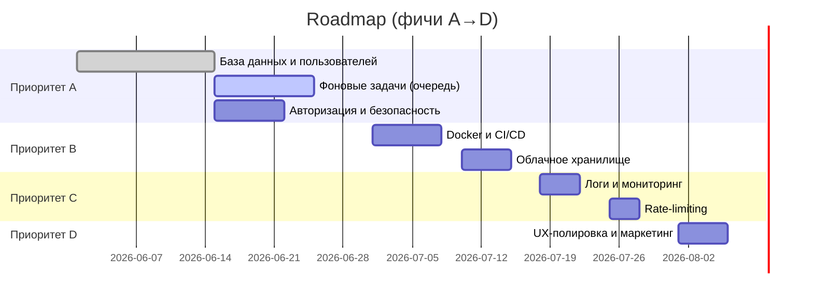

# Executive Summary

Проект генератора сертификатов уже обладает продуманной архитектурой и функционалом. Однако для превращения его в надёжное SaaS-решение требуются доработки: перевод реестров в БД, внедрение фоновых задач через очередь, аутентификация, безопасность и облачное хранение файлов. Доработки улучшат масштабируемость, отказоустойчивость и коммерческую пригодность. Ниже приведены конкретные **вайбкоды** с краткими слоганами, техническими решениями, UX-правками, приоритетами и критериями приёмки.

> **Текущий статус:** всё работает локально, без облака и авторизации.  
> **Roadmap** — план превращения в SaaS.

---

## Вайбкоды улучшений

- **«Состояние не утекает»** – *Проблема:* реестры шрифтов, шаблонов и файлов живут только в памяти; при перезапуске всё сбрасывается. *Техническое решение:* перевести хранение данных в PostgreSQL (node-postgres или ORM). Хранить в БД пользователей, проекты, истории генераций, метаданные файлов. Привязать файлы к записям в БД, например через UUID. *UX:* добавить интерфейс управления проектами и шаблонами в аккаунте. *Приоритет:* A. *Усилия:* 2–3 ЧЕЛ/дня. *Критерии:* после перезапуска сервера данные остаются, ручные тесты CRUD проходят, интеграционные тесты БД успешно выполняются.

- **«Кто ты в системе?»** – *Проблема:* нет авторизации – любой может запускать генерацию и перегружать сервис. *Решение:* реализовать логин/регистрацию (JWT или сессии). Использовать JSON Web Tokens для статeless-аутентификации в Express (проверка подписи в middleware). Добавить роли (админ/пользователь). *UX:* страницы входа/регистрации, личный кабинет (сохранённые проекты). Условно выводить «Генерировать только для авторизованных». *Приоритет:* A. *Усилия:* 1–2 ЧЕЛ/дня. *Критерии:* защитить endpoint `/api/generate`, `/api/upload` – без токена возвращают 401, тесты аутентификации проходят, автоматический тест безопасности.

- **«Очередь – заряд энергии»** – *Проблема:* генерация синхронная; прогресс-бар лишь прыгает 0→100%. При пиковых нагрузках процесс блокирует Node. *Решение:* внедрить BullMQ + Redis. При POST `/generate` создавать job в очереди, Worker (отдельный процесс) берёт задачу, генерирует сертификаты и пишет результаты (загрузка в S3/локальное хранилище). Express следит за состоянием через Redis и отсылает прогресс по WebSocket/SSE. *UX:* прогресс-бар показывает реальный процент, пользователь видит очередь задач и их статусы (в реальном времени через WebSocket). *Приоритет:* A. *Усилия:* 2–3 ЧЕЛ/дня. *Критерии:* load-тест с тысячами записей – сервис остаётся отзывчивым, прогресс обновляется до 100%, нагрузочное тестирование задач проходит.

- **«Файлы в облаках»** – *Проблема:* локальное хранение файлов в `uploads/` и `output/` не масштабируется и не надёжно для SaaS. *Решение:* использовать объектное хранилище – AWS S3 или Cloudflare R2. Сохранять загруженные шаблоны, шрифты и результаты генерации в бакет. Интегрировать с AWS SDK или R2 API (S3-совместимый). *UX:* вместо локальных путей – ссылки на файлы/запаковки; возможность поделиться результатом. *Приоритет:* B. *Усилия:* 1–2 ЧЕЛ/дня. *Критерии:* файлы успешно сохраняются и читаются из S3/R2, проверены сценарии восстановления данных после переезда.

- **«Код в контейнере»** – *Проблема:* нет Docker-развёртывания: сборка зависит от ОС, трудно разворачивать. *Решение:* написать Dockerfile-ы для клиентского и серверного приложения, Docker Compose для окружения (PostgreSQL, Redis, Node). Настроить CI/CD pipeline для автоматического билда и пуша образов. *UX:* (в UI нет изменений). *Приоритет:* B. *Усилия:* 1–2 ЧЕЛ/дня. *Критерии:* через `docker-compose up` сервис разворачивается, интеграционные тесты на контейнерах проходят, готовая инфраструктура на AWS ECS/EKS или другой платформе.

- **«Логи рулят»** – *Проблема:* нет централизованного логирования и аудита. *Решение:* внедрить логгер (Winston, Pino) на бэкенде, логирование запросов и ошибок. Хранить логи файлов или отправлять в ELK/Sentry. *UX:* (не влияет). *Приоритет:* C. *Усилия:* 1 ЧЕЛ/день. *Критерии:* при ошибке сервис пишет подробный лог, регистрируются ключевые события (запуск генерации, авторизация и т.д.), автоматические тесты проверяют наличие логов.

- **«Тормоз не нужен»** – *Проблема:* возможен DDOS или перегрузка API (отправка множества запросов без ограничений). *Решение:* использовать `express-rate-limit` или балансировщик, ограничить количество запросов от одного клиента за определённое время (например, 100 запросов в минуту). *UX:* при превышении лимита – дружелюбная страница «Too Many Requests». *Приоритет:* C. *Усилия:* 0.5–1 ЧЕЛ/день. *Критерии:* после N запросов в минуту API возвращает 429, тесты нагрузки подтверждают ограничение.

- **«Форты безопасности»** – *Проблема:* нет CSRF-защиты, не проверяются анти-вирусом загружаемые файлы, отсутствуют заголовки безопасности. *Решение:* добавить `helmet` (HTTP заголовки защиты), CSRF-токены или проверку Origin, антивирус (ClamAV) для скачанных файлов. Включить OAuth2 при необходимости. *UX:* отображать ошибки проверки с понятными сообщениями. *Приоритет:* C. *Усилия:* 1 ЧЕЛ/день. *Критерии:* Pentest/сканирование не выявляют критических уязвимостей, тесты безопасности проходят.

- **«Интерфейс на стероидах»** – *Проблема:* несмотря на хорошую основу, UX можно улучшить мелочами для удобства. *Решение:* добавить помощники: подсказки на элементах, сообщения об ошибках и успехах (например, когда нет шаблона – предложение скачать пример), улучшить мобилизацию UI. *UX:* всплывающие подсказки (tooltips) на кнопках, адаптировать для мобильных устройств, чётко обозначить обязательные поля. Тема оформления – поддерживать выбор (светлая/тёмная). *Приоритет:* D. *Усилия:* 0.5 ЧЕЛ/дня. *Критерии:* UX-тесты показывают рост удовлетворённости, нет неочевидных пользовательских ошибок.

---

## Таблица приоритетов и усилий

| Фича                           | Приоритет | Усилия         |
|--------------------------------|:---------:|:--------------:|
| PostgreSQL и хранилище данных   | A         | 2–3 дн (средние) |
| Авторизация (JWT)               | A         | 1–2 дн (средние) |
| Фоновые задачи (BullMQ+Redis)   | A         | 2–3 дн (средние) |
| Облачное хранилище (S3/R2)      | B         | 1–2 дн (средние) |
| Docker & CI/CD                  | B         | 1–2 дн (средние) |
| Логирование и мониторинг        | C         | ~1 дн (низкие)  |
| Rate Limiting                   | C         | ~0.5 дн (низкие) |
| Улучшения UI/UX                 | D         | ~0.5 дн (низкие) |

---

## Промпты для дизайнеров и разработчиков

- **Для UI/UX-дизайнеров:**
  1. *«Создайте макет страницы входа/регистрации»* – учитывая стиль текущего приложения, спроектируйте простой экран логина с полями Email/Пароль и кнопкой «Войти». Подумайте о цветах, валидации полей и сообщениях об ошибках.
  2. *«Нарисуйте прогресс-бар генерации»* – нарисуйте элемент для отображения реального прогресса пакетной генерации через WebSocket. Подумайте, как показывать время ожидания и статус (например, число сертификатов).
  3. *«Улучшите уведомления»* – создайте концепт всплывающих уведомлений (toast), отображающих успех и ошибки генерации, с понятными иконками и текстом. Убедитесь в доступности (читабельность, контраст).
  4. *«Мобильный вид шаблона»* – адаптируйте интерфейс загрузки Excel/шаблона и редактора полей под узкие экраны, сохранив фукнциональность drag-and-drop и preview.
  5. *«Темная и светлая тема»* – предложите цветовые палитры и переключатель темы приложения, сохранив фирменный стиль (градиенты, glassmorphism).

- **Для backend-разработчиков:**
  1. *«Реализуйте авторизацию на Express»* – сконфигурируйте JWT-аутентификацию: middleware, генерацию токена при логине, проверку токена на защищённых маршрутах. Добавьте ассоциацию токена с пользователем в БД.
  2. *«Настройте очередь BullMQ»* – создайте очередь задач (BullMQ) на Redis: producer (добавляет задания при POST /generate), worker (генерирует сертификаты и сохраняет результат). Настройте параллельную обработку и retry при неудаче.
  3. *«Переведите реестры в PostgreSQL»* – спроектируйте таблицы для пользователей, шаблонов, шрифтов, задач. Напишите сервисы на Node.js (pg Pool или ORM) для CRUD операций, реализовав атомарные транзакции при необходимости.
  4. *«Интегрируйте S3/R2 хранилище»* – используя AWS SDK (или R2 с S3-совместимым API), реализуйте загрузку/скачивание файлов (шаблоны и результаты) в облако. Настройте переменные окружения и тесты на доступ.
  5. *«Dockerize+Compose»* – напишите Dockerfile для сервера и клиента, а также docker-compose.yaml, включающий сервисы: node-приложение, Redis, PostgreSQL. Убедитесь, что всё поднимается командой `docker-compose up`.

---

## Тексты для маркетинга и монетизации

- **Вариант 1:** «Перенесите вашу школу или вуз в цифру! Наш B2B-сервис для генерации сертификатов автоматически превращает таблицу участников в аккуратные PDF-файлы. Забудьте про рутинный Excel – давайте фокус на образовании!»  
- **Вариант 2:** «Ускорьте подготовку документов: создавайте дипломы, благодарственные письма и бейджи одним кликом. Инновационный генератор сертификатов с поддержкой кириллицы и масштабируемой архитектурой уже готов к вашему ПОТРЕБИТЕЛЮ!»  
- **Вариант 3:** «Превратите Excel в сертификацию без лишних усилий. Университетам и акселераторам: наш SaaS-сервис генерирует любое количество именных PDF в считанные минуты. Готовые сертификаты по подписке – идеальное решение для больших мероприятий.»

---

## Диаграммы

```mermaid
graph LR
  UI(Frontend<br/>(React + Vite))
  API(Server<br/>(Express))
  DB[(PostgreSQL)]
  Queue[(BullMQ/Redis)]
  Worker1((Worker))
  Worker2((Worker))
  Storage[(S3/R2 Storage)]
  WebSocket[/"WebSocket\n(SSE)"/]
  
  UI -- REST API, WebSocket --> API
  API --> DB
  API --> |Add job| Queue
  Queue -- Consume --> Worker1
  Queue -- Consume --> Worker2
  Worker1 --> Storage
  Worker2 --> Storage
  Worker1 -- Update status --> API
  Worker2 -- Update status --> API
  API -- Push updates --> UI
```



---

**Источники:** официальная документация PostgreSQL/Node.js, BullMQ, Redis, React, Vite, Express, pdf-lib/fontkit, а также материалы по Express-rate-limit и JWT-аутентификации.
